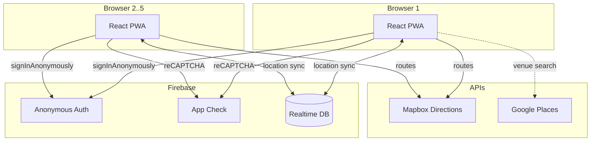
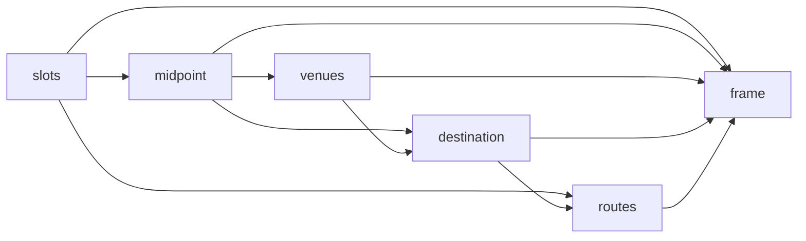

# Meet Me Halfway

**A real-time midpoint PWA for up to 5 participants.** Share a link, stream locations live, find nearby venues, and meet in the middle — all from the browser.


<!-- Screenshot / demo GIF placeholder -->
<!--  -->

> **Zero backend** — fully client-side PWA. Talks directly to Firebase RTDB and Mapbox APIs. Deployable as a static site.

---

## Features

- **Multi-Participant** — Up to 5 participants per session with color-coded markers (green, blue, orange, purple, pink)
- **Live Location Streaming** — All participants stream GPS coords via Firebase RTDB in real-time
- **Geographic Centroid** — Cartesian mean on unit sphere updates live as any participant moves
- **Venue Search** — Google Places API finds nearby restaurants, cafes, and bars ranked by rating, proximity, popularity, and open status
- **N-Participant Routing** — Mapbox Directions API shows driving or walking routes for all participants to the meeting point
- **Dark Map UI** — Mapbox GL JS 3.x dark basemap with glass-morphism cards, accuracy circles, and smooth transitions
- **Navigation Links** — One-tap Waze / Google Maps deep links to the selected venue or midpoint
- **Session Codes** — 6-character codes with WhatsApp share and copy-link for instant invites
- **Stale Detection** — Per-participant offline detection (> 30s) triggers dimmed marker + warning banner
- **Error Handling** — GPS denied/unavailable/timeout with retry, offline/reconnect banner, 24h session expiry
- **App Check** — Firebase App Check with reCAPTCHA Enterprise (optional, graceful degradation)
- **i18n + RTL** — English, Hebrew with full RTL support via CSS logical properties
- **PWA** — Installable, offline fallback, service worker caching
- **Declared execution graph** — the derived pipeline runs as a DAG with cycle detection, per-node circuit breakers, retry and last-known-good degradation ([ARCHITECTURE.md](ARCHITECTURE.md))
- **344 Unit + Integration Tests** — geo-math, slot allocation, session codes, auth (retry), live session (throttle/stale/expiry), venue ranking, GPS errors, graph runtime, resource policies, page lifecycle

---

## Live Demo

**[meet-me-halfway-4ae79.web.app](https://meet-me-halfway-4ae79.web.app)**

---

## Architecture


```mermaid
graph TB
    subgraph "Browser 1"
        A[React PWA]
    end
    subgraph "Browser 2..5"
        B[React PWA]
    end
    subgraph "Firebase"
        AUTH[Anonymous Auth]
        AC[App Check]
        RTDB[(Realtime DB)]
    end
    subgraph "APIs"
        MB[Mapbox Directions]
        GP[Google Places]
    end

    A -->|signInAnonymously| AUTH
    B -->|signInAnonymously| AUTH
    A -->|reCAPTCHA| AC
    B -->|reCAPTCHA| AC
    A <-->|location sync| RTDB
    B <-->|location sync| RTDB
    A -->|routes| MB
    B -->|routes| MB
    A -.->|venue search| GP
```

All browsers compute the midpoint client-side using a geographic centroid (Cartesian mean on unit sphere) — no server needed.

Within each browser the derived work runs as a declared graph:


```mermaid
graph LR
    S[slots] --> M[midpoint]
    M --> V[venues]
    M --> D[destination]
    V --> D
    S --> R[routes]
    D --> R
    S --> F[frame]
    M --> F
    V --> F
    D --> F
    R --> F
```

Edges are declared in one place and checked for cycles at load; the effectful
nodes carry retry, circuit breaking and last-known-good degradation. See
[ARCHITECTURE.md](ARCHITECTURE.md).

---

## Tech Stack

| Layer | Tech |
|-------|------|
| UI | React 19 + Vite 6 + Tailwind CSS 4 |
| Maps | Mapbox GL JS 3.x (dark-v11 basemap) |
| Auth | Firebase Anonymous Auth (silent sign-in) |
| Security | Firebase App Check (reCAPTCHA Enterprise) |
| Real-time | Firebase 12 Realtime Database |
| Routing | Mapbox Directions API (client-side) |
| Venues | Google Places API (New) — optional |
| Midpoint | Geographic centroid (Cartesian mean on unit sphere) |
| i18n | i18next — English, Hebrew (full RTL) |
| Pipeline | Declared DAG + resource combinator (retry / breaker / degrade) |
| Tests | Vitest + React Testing Library (344 tests) |

---

## Quick Start

```bash
# 1. Clone the repo
git clone https://github.com/zeevmala/meet-me-halfway.git
cd meet-me-halfway

# 2. Install dependencies
cd apps/web
npm install

# 3. Configure environment
cp ../../.env.example ../../.env
# Edit .env with your API keys (see table below)

# 4. Start dev server
npm run dev
# Opens at http://localhost:5173
```

---

## Environment Variables

Create a `.env` file at the project root:

| Variable | Required | Description |
|----------|----------|-------------|
| `VITE_MAPBOX_TOKEN` | Yes | Mapbox public token (`pk.*`) for map rendering + Directions API |
| `VITE_FIREBASE_API_KEY` | Yes | Firebase Web API key |
| `VITE_FIREBASE_AUTH_DOMAIN` | Yes | Firebase Auth domain (`*.firebaseapp.com`) |
| `VITE_FIREBASE_DATABASE_URL` | Yes | Firebase RTDB URL (`https://*.firebaseio.com`) |
| `VITE_FIREBASE_PROJECT_ID` | Yes | Firebase project ID |
| `VITE_RECAPTCHA_SITE_KEY` | Yes | reCAPTCHA Enterprise site key for App Check |
| `VITE_GOOGLE_PLACES_API_KEY` | No | Google Places API key — venue search disabled if not set |

---

## Project Structure

```
meet-me-halfway/
├── apps/web/                      # React PWA
│   ├── src/
│   │   ├── core/dag/                  # execution core: Result, breaker, resource combinator
│   │   ├── features/live-midpoint/    # Core feature
│   │   │   ├── LiveMidpointPage.tsx   # Page orchestrator
│   │   │   ├── components/            # LiveMap, markers, cards
│   │   │   ├── graph/                 # edges, nodes, policies, ports, runtime
│   │   │   ├── hooks/                 # useLiveGeolocation, useLiveSession (source adapters)
│   │   │   ├── lib/                   # geo-math, slot-registry, venue-ranking, places-api, directions-api
│   │   │   └── styles/               # Dark glass-morphism theme
│   │   ├── hooks/                     # useFirebase, useAuth, useNetworkStatus
│   │   ├── i18n/                      # en.json, he.json
│   │   └── main.tsx
│   ├── public/                        # PWA manifest, service worker, icons
│   └── package.json
├── infra/
│   ├── database.rules.json            # Firebase RTDB security rules
│   └── firebase.json                  # Firebase Hosting config
├── ARCHITECTURE.md                    # Pipeline topology, resilience, Big-O
├── .github/workflows/web.yml          # CI: lint + typecheck + test + build + e2e
├── .env.example
└── LICENSE
```

---

## How It Works

1. **Auth** — Firebase Anonymous Auth signs in silently on app load
2. **Create** — 6-character session code generated, URL becomes `/?code=XXXXX`
3. **Join** — Up to 4 others open the shared link and join the session
4. **Stream** — All locations stream to Firebase RTDB (throttled to 1 write/3s, uid-scoped)
5. **Midpoint** — Client computes geographic centroid in real-time
6. **Routes** — Mapbox Directions API fetches driving/walking routes for all participants
7. **Venues** — Google Places API searches nearby; ranked by rating, proximity, popularity, open status
8. **Navigate** — Tap a venue to pin as meeting point; one-tap Waze/Google Maps navigation

---

## Testing

```bash
cd apps/web
npx vitest run     # 344 unit + integration tests
npm run tsc        # TypeScript strict mode check
```

---

## Build & Deploy

```bash
cd apps/web
npm run build      # Output in dist/
```

Deploy `dist/` to any static host:
- **Firebase Hosting:** `firebase deploy`
- **Vercel:** connect repo, set root to `apps/web`
- **Netlify:** set build dir to `apps/web/dist`

---

## App Check Debug Token

In development, App Check uses a debug token. On first run, a debug token is printed to the browser console. Register it in the Firebase Console under **App Check > Apps > Manage debug tokens**.

---

## i18n

Two locales with full RTL support: English (`en`), Hebrew (`he`).
Translation files in `apps/web/src/i18n/`.

---

## License

[MIT](LICENSE) — Zeev Mala
